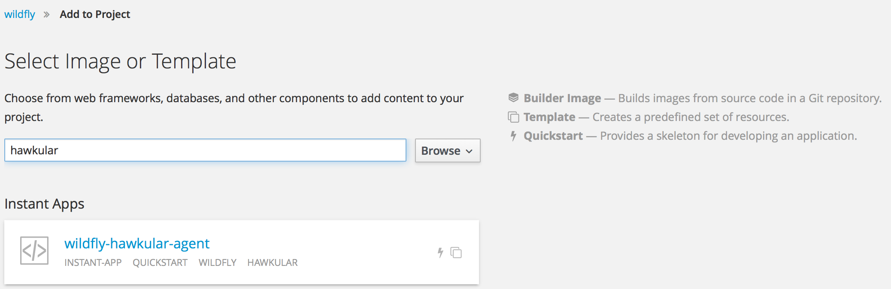
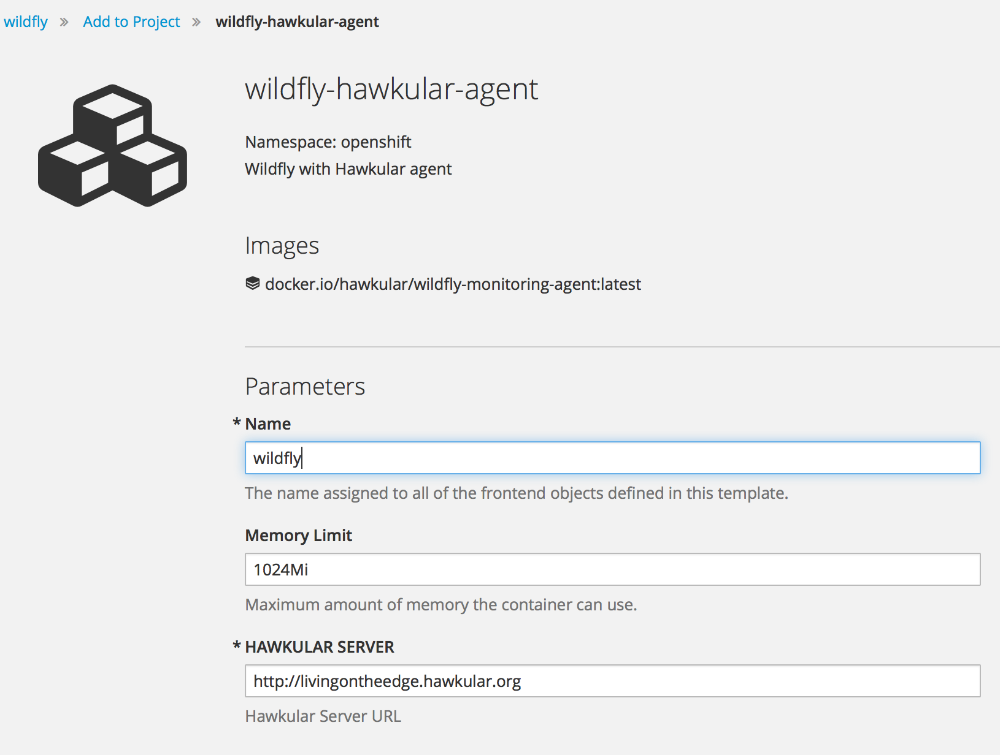

## Deploy Wildfly with Hawkular Agent in Openshift v3
Load the template into `openshift` namespace 
```
oc create -f wildfly-hawkular.yaml -n openshift
```
In Openshift Console go to 'Add to Project' and search for `wildfly-hawkular-agent` template


Adjust the HAWKULAR_SERVER value to reflect your environment



